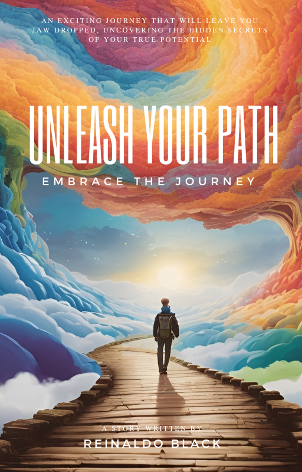

  

# Amazon Bestselling Books Analysis

This repository contains an analysis of the Amazon top 50 bestselling books from 2009 to 2019.
The analysis includes data visualization, descriptive statistics, and insights about the books.

## Installation

To run the code in this repository, you need to have the following libraries installed:

- pandas
- matplotlib
- seaborn

## Dataset

The dataset used in this analysis is available in the file `bestsellers with categories.csv`. It contains information about the top bestselling books, including their name, author, genre, user rating, reviews, price, and year.

## Analysis

The analysis script performs the following tasks:

1. "Loading and Understanding the Dataset"

2. Handling "Null Values".

3. Visualizing the "Distribution of Genres".

4. Analyzing the "Frequenci data Distribution".

5. Analyzing the changes in "Average User Rating", "Total Reviews", and "Average Price Over the Years".

6. Visualizing the "Genre-Wise Distribution" of data

7. Visualizing the "Year-Wise and Genre-Wise Distribution" of selected columns

8. Finding the "Lowest User Rating Books"

- Fiction - 1 / 3.3

9. Finding the "Highest User Rating Books"

- Fiction - 22 / 4.9
 - Non Fiction - 6 / 4.9

10. Identifying books with the "Minimum Reviews".

- Non Fiction - 1 / 37

11. Identifying books with the "Maximum Reviews"

- Fiction - 1 / 87841

12. Calculating the average price for the "Non-Fiction" genre

- Fiction - $10.85
- Non Fiction - $14.84

13. Identifying "Books that were Successful in Multiple Years". 

- The Help (Sucesso nos anos: 2009, 2010, 2011, 2011)
- The Last Olympian (Percy Jackson and the Olympians, Book 5) (Sucesso nos anos: 2009, 2010)
- The Hunger Games Trilogy Boxed Set (1) (Sucesso nos anos: 2011, 2012)
- Goodnight, Goodnight Construction Site (Hardcover Books for Toddlers, Preschool Books for Kids) (Sucesso nos anos: 2012, 2013)
- Oh, the Places You'll Go! (Sucesso nos anos: 2012, 2013, 2014, 2015, 2016, 2017, 2018)
- The Very Hungry Caterpillar (Sucesso nos anos: 2013, 2014, 2015, 2016, 2017)
- Brown Bear, Brown Bear, What Do You See? (Sucesso nos anos: 2017, 2019)
- Dog Man: Brawl of the Wild: From the Creator of Captain Underpants (Dog Man #6) (Sucesso nos anos: 2018, 2019)

14. "Age group" that had the most books.

- Age Group: From 8 years
  - Numbers of Books: 22

- Age Group: From 3 years
  - Numbers of Books: 6

- Age Group: From 10 years
  - Numbers of Books: 5

- Age Group: From 18 years
  - Numbers of Books: 4

- Age Group: From 13 years
  - Numbers of Books: 1
 
15. The "Books" that were "Top" for the "Most Consecutive Years".

- Oh, the Places You'll Go! (Sucesso nos anos: 2012, 2013, 2014, 2015, 2016, 2017, 2018)
- The Very Hungry Caterpillar (Sucesso nos anos: 2013, 2014, 2015, 2016, 2017)

16. what do these books have in commom , Oh, the Places You'll Go!, The Very Hungry Caterpillar ?

    "Oh, the Places You'll Go!" by Dr. Seuss and "The Very Hungry Caterpillar" by Eric Carle are both popular children's books that have become beloved classics. While they have different storylines and themes, there are a few common elements and characteristics that these books share:
    
    1. Engaging Illustrations: Both books feature vibrant and visually appealing illustrations that captivate young readers. The illustrations play a significant role in conveying the story and capturing the imagination of children.
    
    2. Simple and Repetitive Language: Both books utilize simple and repetitive language patterns, making them accessible to young readers. This repetition helps in reinforcing key concepts and engaging children in the storytelling process.
    
    3. Exploration and Growth: Both books explore the themes of growth, transformation, and personal development. "Oh, the Places You'll Go!" focuses on the journey of life, while "The Very Hungry Caterpillar" depicts the transformation of a caterpillar into a beautiful butterfly.
    
    4. Interactive Elements: "The Very Hungry Caterpillar" incorporates interactive elements such as counting, days of the week, and the physical act of turning pages to engage young readers actively. Similarly, "Oh, the Places You'll Go!" encourages readers to imagine and visualize their own future adventures.
    
    5. Inspirational Messages: Both books carry messages of hope, resilience, and the potential for personal achievement. They inspire young readers to embrace curiosity, explore the world, persevere through challenges, and believe in their own abilities.
    
    While each book has its unique charm and style, these shared elements contribute to their enduring popularity and appeal among children and adults alike.

17. what happened between 2012, 2013, 2014, 2015, 2016, 2017, 2018 for these books to be so successful?
    
    Both "The Very Hungry Caterpillar" by Eric Carle and "Oh, the Places You'll Go!" by Dr. Seuss have enjoyed sustained success and popularity over the years. Here are some key factors that may have contributed to their success during the years 2012-2018:
    
    1. Timeless Appeal: Both books have timeless themes and messages that resonate with readers of all ages. "The Very Hungry Caterpillar" explores concepts like growth, transformation, and the importance of healthy eating, while "Oh, the Places You'll Go!" touches on life's journey, perseverance, and self-belief. These universal themes continue to resonate with readers year after year.
    
    2. Educational Value: Both books offer educational value to young readers. "The Very Hungry Caterpillar" teaches counting, days of the week, and basic concepts like food and nature. "Oh, the Places You'll Go!" encourages imagination, introduces new vocabulary, and promotes critical thinking about life choices and goals. Their educational aspects make them appealing to parents, educators, and children alike.
    
    3. Positive Reception: Both books have received widespread acclaim and positive reviews from readers, parents, educators, and literary critics. The combination of engaging storytelling, captivating illustrations, and meaningful messages has contributed to their enduring popularity.
    
    4. Cultural Significance: "The Very Hungry Caterpillar" and "Oh, the Places You'll Go!" have become cultural touchstones and are often included in children's literature curricula, libraries, and early childhood settings. Their enduring popularity and cultural significance have helped maintain their success over the years.
    
    5. Longevity and Legacy: Both books were published several decades before the years you mentioned, with "The Very Hungry Caterpillar" originally published in 1969 and "Oh, the Places You'll Go!" in 1990. Their continued success can be attributed to their ability to capture the imaginations of multiple generations. The books have been passed down from parents to children, recommended by educators, and cherished as beloved classics.
    
    6. Gift and Milestone Purchases: Both books are often chosen as gifts for special occasions such as baby showers, birthdays, and graduations. Their popularity as gift choices has contributed to their consistent sales and visibility.
    
    7. International Reach: Both books have been translated into numerous languages and have gained popularity worldwide. Their accessibility and global recognition have contributed to their ongoing success and sales.
    
    It's important to note that these factors are not exhaustive, and the success of any book is influenced by a combination of various elements. The enduring popularity and success of "The Very Hungry Caterpillar" and "Oh, the Places You'll Go!" can be attributed to their universal appeal, educational value, positive reception, cultural significance, and their ability to capture the hearts and imaginations of readers across generations.

18. The most ideal Book to launch a book based on top 5 best-selling book every year is:

- Fiction

19. Book created from the insghts of this project.

Name: Unleash Your Path- Embrace the Journey

  

[Download in the Google Drive](https://drive.google.com/file/d/1pm0uhfU9drKcnZ8MU8KC2CksnfV8i_Qg/view?usp=sharing)

## Insight

Proposal for Book Launch: Conclusion

In conclusion, after conducting thorough research and analysis for the upcoming book launch, we have identified valuable insights to guide our strategy as a publishing house. As requested, we focused on identifying the ideal genre and target audience to maximize reach and sales potential.

Considering the research findings, we recommend a strategic approach that balances both bestselling potential and average ticket price. Fiction books, due to their broad appeal and wide readership, present an excellent opportunity for achieving high sales volumes. However, if the objective is to optimize the average ticket price, non-fiction books hold greater potential.

One notable finding is that the age group from 8 years and onwards demonstrated the highest book consumption. This age range represents a crucial stage in children's development, where foundational principles are formed, and parental influence remains significant. Therefore, parents sought books such as "Oh, the Places You'll Go!" and "The Very Hungry Caterpillar" that instill inspiration and values in their children.

Based on our analysis, we recommend pricing the book at $9.99, as this is a reasonable and appealing price point for this genre and target audience.

Furthermore, we identified common themes and elements in the successful books "Oh, the Places You'll Go!" and "The Very Hungry Caterpillar." Utilizing these insights, we have crafted a captivating story tailored to the 8-year-old age group, incorporating similar approaches that resonate with parents and children alike.

In summary, our research and analysis have provided valuable insights for the upcoming book launch. By strategically aligning the genre, target audience, pricing, and storytelling approach, we aim to maximize the book's appeal and commercial success. We are excited to collaborate with the esteemed publishing house in bringing this captivating book to the market and inspiring young readers on their own unique journeys of self-discovery and growth.

- ##### The suggested name of the book was "Unleash Your Path- Embrace the Journey".

- ##### The central message of book "Unleash Your Path- Embrace the Journey".

The central message of the book "Unleash Your Path: Embrace the Journey" is to inspire individuals to embrace their personal journeys of self-discovery, growth, and fulfillment. It encourages readers to tap into their inner potential, overcome obstacles, and live a purposeful and authentic life.

The book emphasizes the importance of self-reflection, encouraging readers to delve deep within themselves to uncover their passions, values, and dreams. It guides them to identify their unique path and make intentional choices aligned with their true selves.

Throughout the pages, the book emphasizes the significance of embracing change, uncertainty, and challenges as opportunities for growth. It encourages readers to cultivate resilience, adaptability, and a positive mindset, empowering them to navigate obstacles and setbacks with grace and determination.

Another vital aspect of the book is the importance of building a supportive network. It highlights the value of surrounding oneself with positive, like-minded individuals who uplift, inspire, and provide a sense of community. Building meaningful relationships and seeking support from others is emphasized as a crucial element in personal growth and success.

Overall, "Unleash Your Path: Embrace the Journey" aims to inspire readers to embark on a transformative journey of self-discovery, to embrace their uniqueness, and to pursue a fulfilling life aligned with their passions and purpose. It encourages individuals to break free from limitations, unleash their potential, and embrace the endless possibilities that lie before them on their personal paths.

Thank you for entrusting us with this project, and we look forward to a successful partnership.

